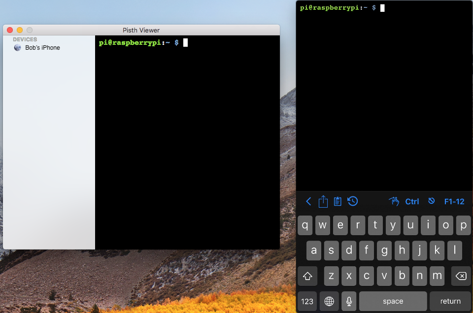

# Pisth Viewer

[Download](https://pisth.github.io/PisthViewer/PisthViewer.zip)

Pisth Viewer allows you to view the content of a terminal opened with Pisth in iOS from your Mac.

## How it works?

Just open a terminal in [Pisth](https://pisth.github.io), and your iOS device will appear in Pisth Viewer if both Mac and iOS device are connected to the same network.
