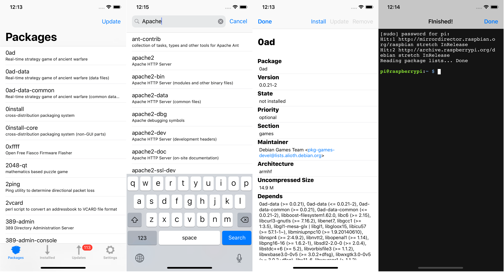

# Pisth APT

From the developer of Pisth! Pisth APT allows you to manage your packages on Debian based Linux distro from your iPhone or iPad using SSH.

Why use Pisth APT:

• Pisth APT is free (but there are ads). 
• You can easily browse, install, uninstall and update pakages.

Pisth APT is based on Pisth.
