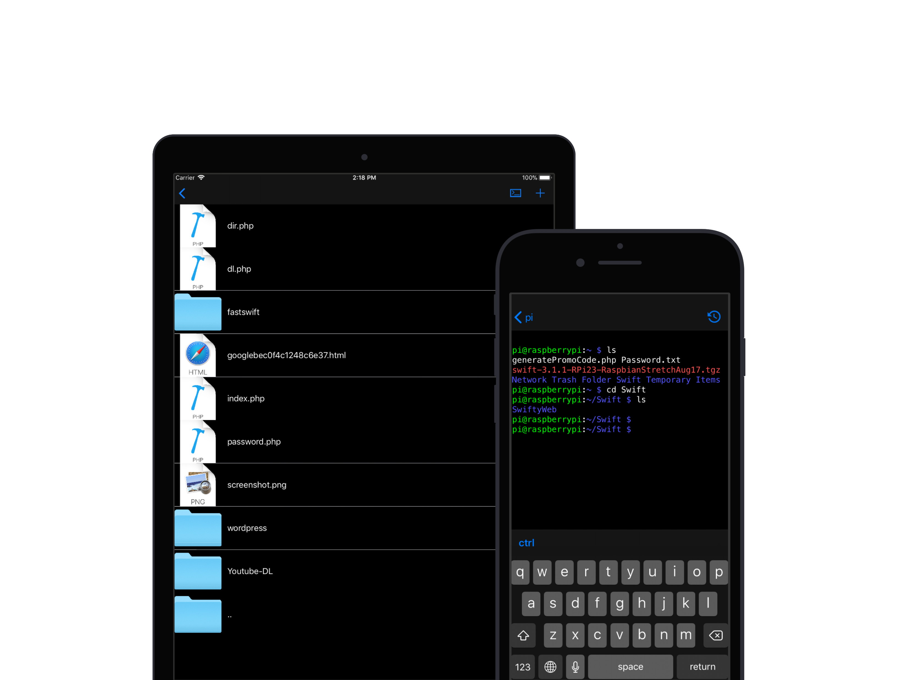

## Why use Pisth?

With Pisth you can work with files and use them with SSH shell. It works also as a good mobile IDE, you can write code from editor, and compile from the shell.

  - Pisth is totally free (but there is ad banners)
  - You can manage files in your SSH server and use the Shell in the same app.
  - You can edit text files and code with colored syntax
  - The Shell supports colors and real time output and input, so you can use text editors such as nano, vim, etc.
  - The Shell supports Bluetooth keyboard including arrows and ctrl keys.

## Screenshots

<iframe src="https://pisth.github.io/screenshots/" width="100%" height="200px" frameborder="0"></iframe>

## Join Beta
[Join beta here](beta)
