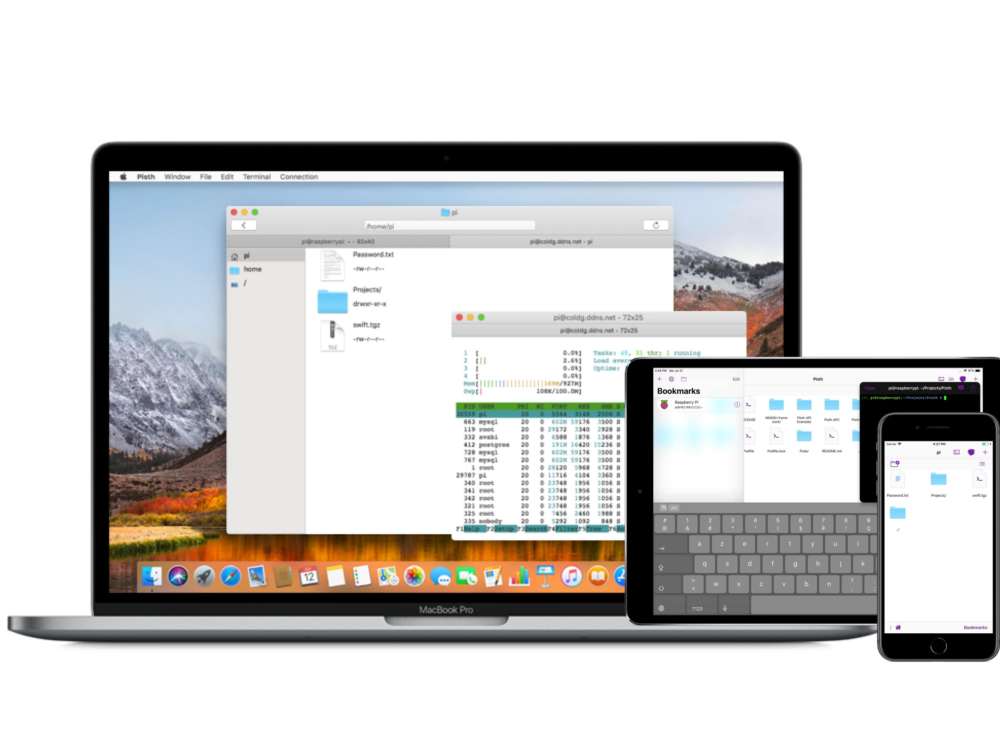

## Why use Pisth?

With Pisth you can work with files and use them with SSH shell. It works also as a good mobile IDE, you can write code from editor, and compile from the shell.

## Features

- [x] Register connections
- [x] Browse remote files
- [x] Edit remote files
- [x] Upload local files
- [x] Open a Shell in current directory
- [x] Shell Colors
- [x] Show commands history in app
