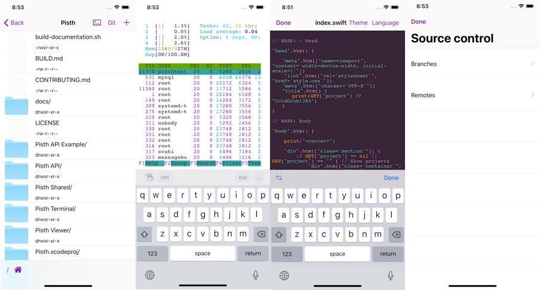

# Why use Pisth?

With Pisth you can work with files and use them with SSH shell. It works also as a good mobile IDE, you can write code from editor, and compile from the shell.

- Pisth is free (but there are ad banners and In App Purchases).
- You can manage files in your SSH server and use the Shell in the same app.
- You can edit text files and code with colored syntax.
- The Shell supports colors and real time output and input, so you can use text editors such as nano, vim, etc.
- The Shell supports Bluetooth keyboard including arrows and ctrl keys but excluding function keys.

# API

Pisth has an API for importing files from your own app. See more at [https://pisth.github.io/docs/api/getting-started.html](https://pisth.github.io/docs/api/getting-started.html)
