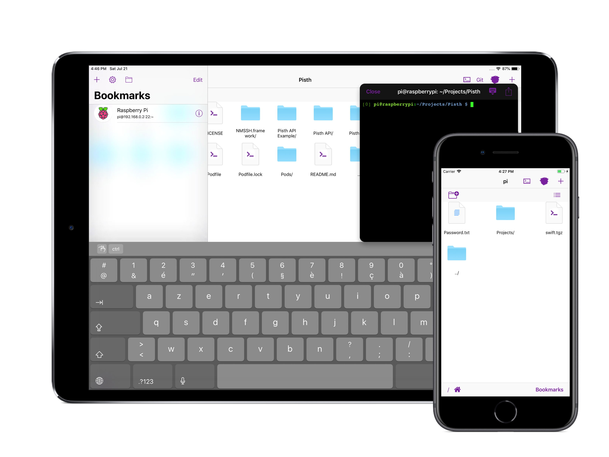

# Pisth
 

# 11.0 Coming soon!

The 11.0 version will be available on September with compatibilty for iOS 12 features, better multitasking for iPad and more! [Send me an email](mailto:adri_labbe@hotmail.com?subject=Pisth%20Beta%20Testing) for beta testing.

Why use Pisth?

With Pisth you can work with files and use them with SSH shell. It works also as a good mobile IDE, you can write code from editor, and compile from the shell.

- Pisth is free (but there are ads and In App Purchases).
- You can manage files in your SSH server and use the Shell in the same app.
- You can edit text files and code with colored syntax.
- The Shell supports colors and real time output and input, so you can use text editors such as nano, vim, etc.
- The Shell supports Bluetooth keyboard including arrows and ctrl keys but excluding function keys.

